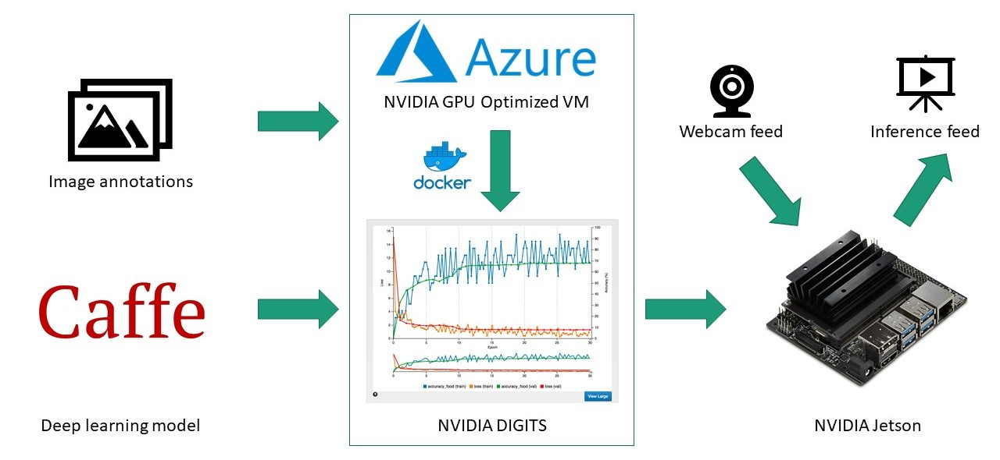

# Boxing Glove Object Detection

Implementing object detection with boxing gloves on the [NVIDIA Jetson Nano](https://developer.nvidia.com/embedded/jetson-nano-developer-kit) using the CUDA platform.

## Inference Results

### Real-Time Detection

### Offline Image Detection

## Training and Inference Architecture

